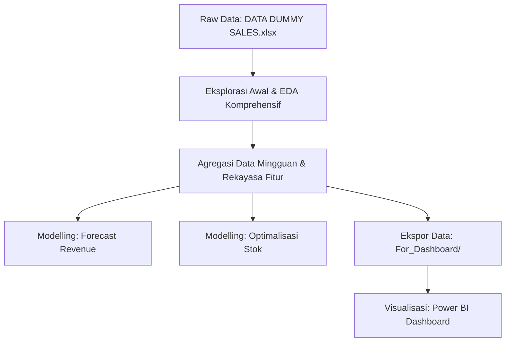

# 📈 Analisis Revenue & Optimalisasi Stok Semen

Proyek ini berfokus pada analisis data transaksi penjualan (_sell-in_ dan _sell-out_), kapasitas gudang distributor (_Customer Attachment_ / CA), serta data survei toko untuk meningkatkan kinerja pendapatan (_revenue_) dan mengoptimalkan manajemen stok (_inventory control_) di jaringan distribusi semen menggunakan data tiruan (_dummy data_).

> [!NOTE]
> Proyek ini menggunakan teknik _Exploratory Data Analysis_ (EDA) komprehensif, pemodelan prediktif berbasis _Machine Learning_, dan visualisasi interaktif melalui Power BI untuk mendukung pengambilan keputusan strategis.

---

## 📂 Struktur Direktori Proyek

Berikut adalah gambaran besar file dan folder dalam proyek ini (di luar folder `Dashboard_ExDA`):

```markdown
├── 📂 SIG Project/
│ ├── DATA DUMMY SALES.xlsx ............................ Dataset mentah utama penjualan & distributor
│ ├── Dashboard_PowerBI.pbix ........................... File project Power BI untuk visualisasi interaktif
│ ├── Dashboard_PowerBI.pdf ............................ Dokumen ekspor visualisasi dashboard dalam format PDF
│ ├── EDA_SIG_Comprehensive.ipynb ...................... Notebook analisis EDA komprehensif (Pareto, Coverage, dll.)
│ ├── Peninjauan Awal Dataset.ipynb .................... Notebook eksplorasi awal struktur data mentah
│ ├── Proses_Agregasi_Data_Forecasting.ipynb ........... Notebook pipa pemrosesan data mingguan untuk modeling
│ ├── Modelling_Forecast_Revenue.ipynb ................. Notebook machine learning prediksi penjualan distributor
│ ├── Modelling_Optimation_Stock.ipynb ................. Notebook machine learning optimalisasi penerimaan pasokan gudang
│ ├── data_for_forecast_revenue.csv ................... Dataset hasil agregasi untuk modeling revenue
│ ├── data_for_optimizing.csv ......................... Dataset hasil agregasi untuk modeling optimalisasi pasokan gudang
│ │
│ ├── 📂 models/ ....................................... Model terlatih yang disimpan sebagai objek serialized
│ │ ├── best_revenue_model.pkl ....................... Model LightGBM terbaik untuk prediksi revenue
│ │ ├── best_stock_model.pkl ......................... Model LightGBM terbaik untuk optimalisasi stok
│ │ ├── encoders_revenue.pkl ......................... LabelEncoder untuk variabel kategori model revenue
│ │ └── encoders_stock.pkl ........................... LabelEncoder untuk variabel kategori model stok
│ │
│ └── 📂 For_Dashboard/ ................................ Dataset teragregasi siap muat untuk Power BI
│ ├── Executive_Summary.txt ........................ Ringkasan temuan utama EDA dalam teks ringkas
│ ├── dim_survey.csv ............................... Dimensi data survei lapangan
│ ├── fact_distributor.csv ......................... Fakta profil dan performa distributor
│ ├── fact_inventory.csv ........................... Fakta pergerakan dan kapasitas stok gudang
│ ├── fact_outlet.csv .............................. Fakta kinerja transaksi tingkat outlet (toko)
│ ├── fact_product.csv ............................. Fakta portofolio dan volume produk
│ └── fact_revenue.csv ............................. Fakta realisasi pendapatan (revenue) sell-in
```

### 🔗 Tautan Cepat File Utama

- 📄 **Dataset Utama:** [DATA DUMMY SALES.xlsx](file:///d:/Kalla%20Intern/SIG%20Project/DATA%20DUMMY%20SALES.xlsx)
- 📓 **Notebook Analisis:** [EDA_SIG_Comprehensive.ipynb](file:///d:/Kalla%20Intern/SIG%20Project/EDA_SIG_Comprehensive.ipynb) | [Proses_Agregasi_Data_Forecasting.ipynb](file:///d:/Kalla%20Intern/SIG%20Project/Proses_Agregasi_Data_Forecasting.ipynb)
- 🤖 **Notebook Pemodelan:** [Modelling_Forecast_Revenue.ipynb](file:///d:/Kalla%20Intern/SIG%20Project/Modelling_Forecast_Revenue.ipynb) | [Modelling_Optimation_Stock.ipynb](file:///d:/Kalla%20Intern/SIG%20Project/Modelling_Optimation_Stock.ipynb)
- 💼 **Dashboard & Laporan:** [Dashboard_PowerBI.pbix](file:///d:/Kalla%20Intern/SIG%20Project/Dashboard_PowerBI.pbix) | [Dashboard_PowerBI.pdf](file:///d:/Kalla%20Intern/SIG%20Project/Dashboard_PowerBI.pdf) | [Executive_Summary.txt](file:///d:/Kalla%20Intern/SIG%20Project/For_Dashboard/Executive_Summary.txt)

---

## ⚙️ Alur Analisis & Pemodelan

Pekerjaan dalam proyek ini dibagi ke dalam empat tahapan utama:



1. **Eksplorasi Awal & EDA**: Menganalisis data transaksi penjualan (_sell-in_ & _sell-out_), performa distributor, pola wilayah, rasio pemenuhan stok (_coverage_), serta survei pasar semen.
2. **Pipa Agregasi & Rekayasa Fitur**: Mengubah data transaksi harian menjadi data berorientasi waktu mingguan (_weekly starting_), menghitung fitur jeda (_lags_), statistik bergerak (_rolling statistics_), serta penyandian siklus musiman (_cyclical time encoding_).
3. **Pemodelan Machine Learning (Optuna & TimeSeriesSplit)**: Mengembangkan model berbasis regresi (_LightGBM_ dan _XGBoost_) dengan optimasi hyperparameter otomatis via _Optuna_ untuk meramal target penjualan semen dan pasokan gudang.
4. **Visualisasi BI**: Menyusun struktur data bintang (_Star Schema_) ke dalam folder [For_Dashboard/](file:///d:/Kalla%20Intern/SIG%20Project/For_Dashboard) untuk dikonsumsi langsung oleh Power BI.

---

## 📊 Temuan Utama Bisnis (EDA Findings)

Berdasarkan analisis data historis, diperoleh beberapa temuan kunci:

- **Analisis Revenue:**
  - Total akumulasi _Revenue Sell-In_ semen mencapai **Rp 1.4 Triliun**.
  - Brand dengan kinerja pendapatan terbaik adalah **Atlas** (semen premium).
  - Provinsi penghasil _revenue_ tertinggi adalah **Jambi**.
- **Aturan Pareto (80/20):**
  - Terdapat **78 distributor teratas** (dari total populasi) yang menyumbang **80% total pendapatan**. Fokus dukungan operasional dan retensi logistik harus diarahkan pada 78 distributor utama ini.
- **Keseimbangan Distribusi (Supply-Demand Balance):**
  - Rata-rata _Coverage Ratio_ (_Sell-Out_ dibanding _Sell-In_) nasional adalah **0.900**.
  - Terjadi akumulasi stok bersih (_Sell-In_ melebihi _Sell-Out_) secara agregat sebesar **123.808 TON** semen di gudang-gudang distributor.
- **Kondisi Lapangan (Toko/Outlet):**
  - Tingkat kejadian stok kosong (_Stockout Rate_) di outlet semen adalah **0.0%** saat dikunjungi salesman.
  - Namun, rata-rata tingkat pemenuhan pesanan (_Order Fill Rate_) hanya sebesar **55.5%**, mengindikasikan ketidakefisienan proses restoking atau keterbatasan suplai saat pemesanan semen dibuat.

---

## 🤖 Hasil Pemodelan Machine Learning

Pemodelan membandingkan performa algoritma **LightGBM Regressor** dan **XGBoost Regressor** menggunakan skema evaluasi _temporal split_ (uji data masa depan secara ketat tanpa kebocoran waktu). Hyperparameter disetel menggunakan pustaka _Optuna_.

### 1. Prediksi Penjualan Mingguan Distributor (Forecasting Revenue)

Model memprediksi nilai penjualan semen mingguan tiap distributor (`target_revenue`).

- **Model Terbaik Terpilih:** **LightGBM Regressor**
- **Metrik Kinerja Evaluasi (Test Set):**
  - **MAE (Mean Absolute Error):** Rp 136.352.604,95 (MAE sangat kecil dibanding skala total transaksi Rp 1.4T).
  - **RMSE:** Rp 176.011.155,01
  - **R-squared (R²):** 8.00%
  - **WAPE:** 0.4928
  - **Akurasi Prediksi (1 - WAPE):** **50.72%**
- **Fitur Terpenting (Feature Importance):**
  1. `lag_4w_revenue` (Realisasi penjualan 4 minggu lalu)
  2. `rolling_4w_revenue_std` (Volatilitas historis penjualan)
  3. `lag_1w_volume_sales` (Volume penjualan riil toko minggu lalu)
  4. `lag_1w_sell_through_rate` (Tingkat penyerapan pasar semen minggu lalu)

### 2. Penerimaan Pasokan Gudang (Stock Optimization)

Model memprediksi volume penerimaan mingguan gudang distributor (`actual_tonase_in`) untuk menjaga level stok semen optimal.

- **Model Terbaik Terpilih:** **LightGBM Regressor** (dengan log-transformation target `log1p` saat pelatihan)
- **Metrik Kinerja Evaluasi (Test Set):**
  - **MAE (Mean Absolute Error):** **73.17 TON**
  - **RMSE:** 96.39 TON
  - **WAPE:** 0.8666
  - **Akurasi Prediksi (1 - WAPE):** **13.34%**
- **Fitur Terpenting (Feature Importance):**
  1. `lag_1w_sellout_gudang` (Volume pengiriman semen keluar dari gudang minggu lalu)
  2. `lag_1w_vol_order_dist` (Volume pesanan masuk distributor minggu lalu)
  3. `lag_1w_days_of_supply` (Estimasi sisa hari ketahanan stok semen di gudang)
  4. `lag_1w_stock_toko` (Kondisi stok outlet semen di area cakupan)

---

## 💻 Visualisasi Dashboard

Visualisasi laporan dikemas secara profesional dalam dashboard Power BI dengan nama file [Dashboard_PowerBI.pbix](file:///d:/Kalla%20Intern/SIG%20Project/Dashboard_PowerBI.pbix). Anda dapat melihat pratinjau halaman visualisasi dalam berkas ekspor [Dashboard_PowerBI.pdf](file:///d:/Kalla%20Intern/SIG%20Project/Dashboard_PowerBI.pdf).

Laporan ini menyajikan modul-modul visual:

- **Executive Summary:** KPI agregat revenue semen, volume, coverage ratio, dan performa brand.
- **Distributor & Pareto Analysis:** Pemetaan kinerja kontribusi distributor semen berdasarkan hukum Pareto.
- **Supply-Demand Balance Map:** Visualisasi provinsi yang kelebihan pasokan vs kekurangan pasokan semen.
- **Inventory Control & Survey Dashboard:** Pemantauan status ketahanan stok semen di gudang distributor (_days of supply_) dan performa _fill rate_ outlet.
